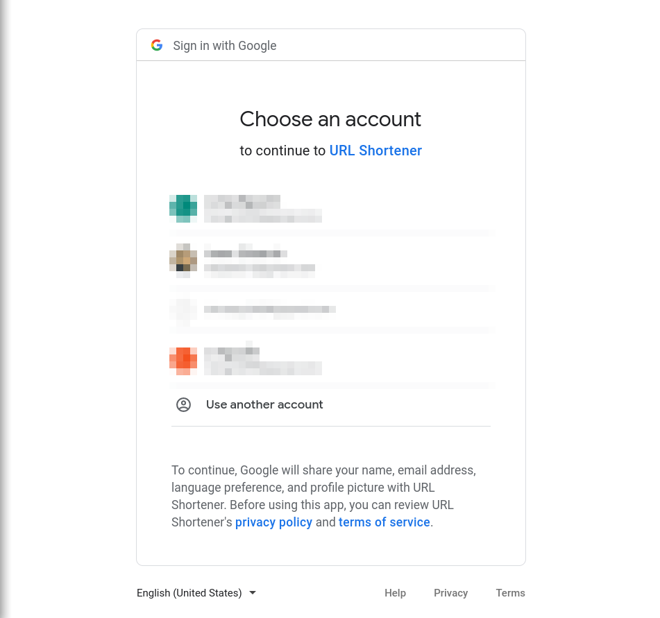
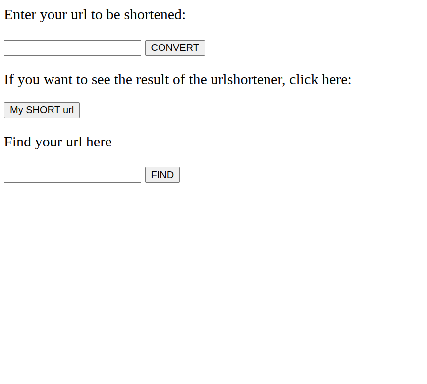
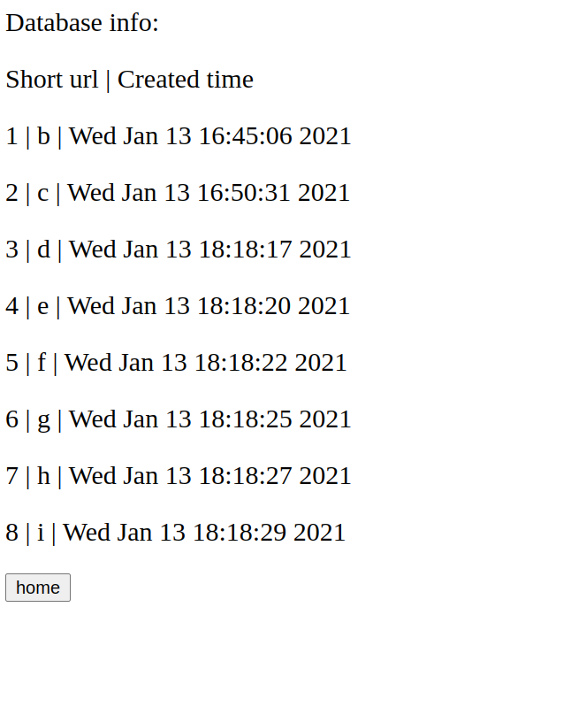

# URL Shortener

* Simple API that will generate Short Url (base-62 converting).

* This API utilizes Flask and Flask-SQLAlchemy framework. User input will be stored in `short-url` database.

* For easy use, `click` and `flask-cli` are integrated to make terminal command to create the data table. 

* `Auth-lib` is integrated to authorize user login with Google OAuth2 authentication.


## Install requirement
**It is recommended to work in `venv`- [python virtual environment](https://docs.python.org/3/tutorial/venv.html) to avoid any collisions with your machine's python configuration**

Execute the command below to install requirement packages:

```pip3 install -r requirements.txt```


## Configuration

* You need to obtain OAuth 2.0 client credentials from the [Google API Console Platform](https://developers.google.com/identity/protocols/oauth2) first to be able to run the API.

* Obtain the google cloud oauth 2.0 client id and secret since we need those to fill out `.env`. 

* `dotenv` is used to work with environment variable, .env file must be created in `app/`.


* `.env` file should look like:

```
FLASK_APP=app
FLASK_SECRET_KEY=<secretkey>
FLASK_ENV=development
OAUTHLIB_INSECURE_TRANSPORT=true
OAUTHLIB_RELAX_TOKEN_SCOPE=true
GOOGLE_CLIENT_ID=<client id generated by google cloud oauth 2.0 service>
GOOGLE_CLIENT_SECRET=<secret generated by google cloud oauth 2.0 service>
DATABASE_URL=sqlite:///short-url.sqlite3
```


## Execution

1. Create the database

``` flask create_db ```

2. Run the app

```flask run```

## Demo






