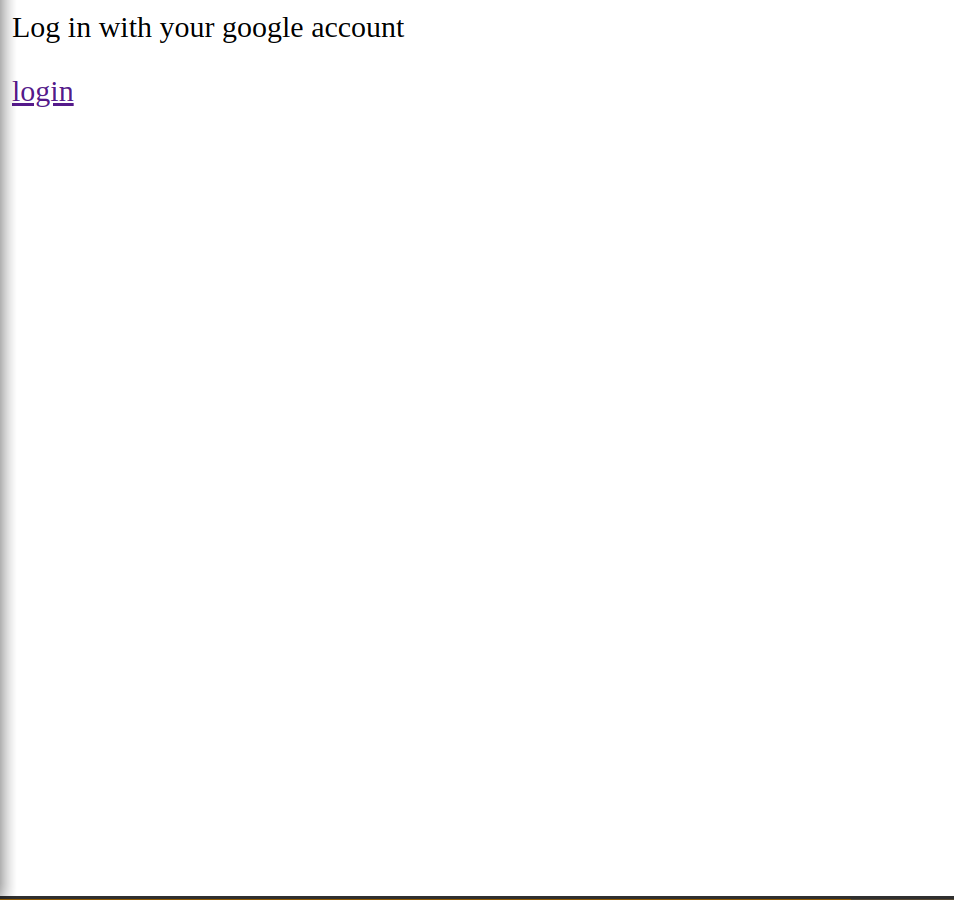

# URL Shortener


## Install requirement
Execute the command below to install requirement packages:

```pip3 install -r requirements.txt```

## Configuration
I use dotenv to manipulate environment variable, a .env file must be created in order to run the app.

.env file should look like:

```
FLASK_APP=app
FLASK_SECRET_KEY=<secretkey>
FLASK_ENV=development
OAUTHLIB_INSECURE_TRANSPORT=true
OAUTHLIB_RELAX_TOKEN_SCOPE=true
GOOGLE_CLIENT_ID=<client id generated by google cloud oauth 2.0 service>
GOOGLE_CLIENT_SECRET=<secret generated by google cloud oauth 2.0 service>
DATABASE_URL=sqlite:///googleauth.sqlite3
```


## Run the app

1. Create the database

``` flask create_db ```

2. Run the app

```flask run```

## Demo




